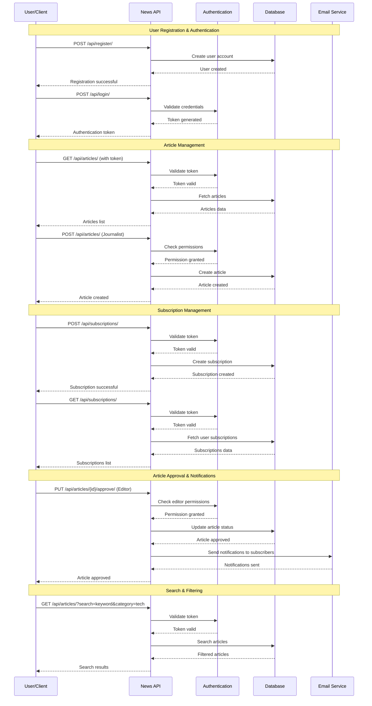

# News Application

A Django-based news application that allows readers to view articles published by publishers and independent journalists, with role-based access control and subscription management.

## Features

### User Roles
- **Reader**: Can view published articles and manage subscriptions
- **Journalist**: Can create, edit, and manage articles and newsletters
- **Editor**: Can review, approve, and manage articles from their publishers

### Core Functionality
- Article creation and management with approval workflow
- Publisher and journalist subscription system
- Email notifications when articles are approved
- Twitter integration for article sharing
- RESTful API for third-party integration
- Role-based access control and permissions

### Technical Features
- Custom User model with role-based fields
- Django signals for automated notifications
- Unit testing
- PEP 8 compliant code
- Simple HTML templates with minimal styling

## Installation

1. Clone the repository:
```bash
git clone <repository-url>
cd news-application
```

2. Create a virtual environment:
```bash
python3 -m venv venv
source venv/bin/activate  # On Windows: venv\Scripts\activate
```

3. Install dependencies:
```bash
pip install -r requirements.txt
```

4. Set up MariaDB database:
```bash
# Start MariaDB service
brew services start mariadb

# Connect to MariaDB and create database
mysql -u root -p
CREATE DATABASE news_app_db CHARACTER SET utf8mb4 COLLATE utf8mb4_unicode_ci;
EXIT;
```

5. Update database password in settings.py:
   - Open `news_app/settings.py`
   - Replace `'your_password_here'` with your MariaDB root password

6. Run migrations:
```bash
python3 manage.py migrate
```

7. Set up user groups and sample data:
```bash
python3 manage.py setup_groups
python3 manage.py create_sample_data
```

8. Run the development server:
```bash
python3 manage.py runserver
```

9. Access the application:
   - Open http://127.0.0.1:8000/ in your browser
   - Use the sample accounts or create new ones

## Configuration

### Email Settings
Update the email configuration in `settings.py`:
```python
EMAIL_HOST_USER = 'your-email@gmail.com'
EMAIL_HOST_PASSWORD = 'your-app-password'
```

### Twitter API
Add your Twitter API credentials to `settings.py`:
```python
TWITTER_BEARER_TOKEN = 'your-twitter-bearer-token'
```

## API Endpoints

### Authentication
- All API endpoints require authentication using Django REST Framework tokens

### Available Endpoints
- `GET /api/articles/` - List articles (filtered by user role and subscriptions)
- `POST /api/articles/` - Create new article (journalists only)
- `GET /api/articles/{id}/` - Get article details
- `PUT /api/articles/{id}/` - Update article
- `DELETE /api/articles/{id}/` - Delete article
- `POST /api/articles/{id}/approve/` - Approve article (editors only)
- `GET /api/publishers/` - List publishers
- `GET /api/categories/` - List categories
- `GET /api/newsletters/` - List newsletters
- `GET /api/subscriptions/` - List user subscriptions
- `POST /api/subscriptions/` - Create subscription
- `GET /api/user-subscriptions/` - Get user's subscribed content

## Email Configuration

### Development (Default)
The application uses console email backend by default in development mode. Emails will be printed to the console instead of being sent.

### Production Setup
To configure email for production, update `news_app/settings.py`:

```python
# For production, set DEBUG = False and configure SMTP
EMAIL_BACKEND = 'django.core.mail.backends.smtp.EmailBackend'
EMAIL_HOST = 'smtp.gmail.com'
EMAIL_PORT = 587
EMAIL_USE_TLS = True
EMAIL_HOST_USER = 'your-email@gmail.com'
EMAIL_HOST_PASSWORD = 'your-app-password'  # Use App Password for Gmail
```

**Gmail Setup:**
1. Enable 2-Factor Authentication
2. Generate an App Password
3. Use the App Password (not your regular password)

## Testing

Run the test suite:
```bash
python manage.py test
```

The test suite includes:
- Model tests for all database models
- View tests for authentication and authorization
- API tests for REST endpoints
- Email notification tests

## Database Schema

### Models
- **User**: Custom user model with role-based fields
- **Publisher**: Publication/publisher information
- **Article**: News articles with approval workflow
- **Category**: Article categorization
- **Newsletter**: Newsletter content
- **Subscription**: User subscriptions to publishers/journalists

### User Groups and Permissions
- **Reader Group**: View permissions for articles and newsletters
- **Journalist Group**: Full CRUD permissions for articles and newsletters
- **Editor Group**: View, update, and delete permissions for articles and newsletters

## Project Structure

```
news_app/
├── news/
│   ├── models.py          # Database models
│   ├── views.py           # Web views
│   ├── api_views.py       # REST API views
│   ├── serializers.py     # API serializers
│   ├── forms.py           # Django forms
│   ├── admin.py           # Admin configuration
│   ├── signals.py         # Django signals
│   ├── tests.py           # Unit tests
│   ├── management/        # Management commands
│   └── templates/         # HTML templates
├── news_app/
│   ├── settings.py        # Django settings
│   └── urls.py           # URL configuration
└── requirements.txt       # Python dependencies
```

## Usage

1. **Register** as a user with your desired role
2. **Journalists** can create articles and newsletters
3. **Editors** can review and approve articles
4. **Readers** can subscribe to publishers and journalists
5. **All users** can view published articles and search content

## API Sequence Diagram

The following diagram shows the typical user interactions with the News API:



## Contributing

1. Follow PEP 8 style guidelines
2. Write tests for new features
3. Update documentation as needed
4. Ensure all tests pass before submitting
